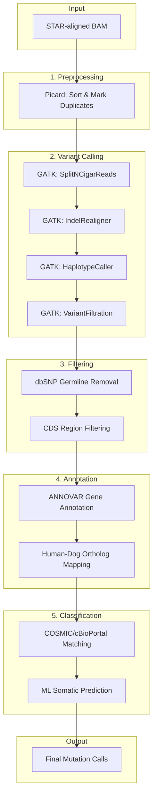

# TORSMIC

**T**umor-**O**nly **R**NA-seq **S**omatic **M**utation **I**dentification in **C**anine


---

## Table of Contents

- [Overview](#overview)
- [Pipeline Workflow](#pipeline-workflow)
- [Requirements](#requirements)
- [Installation](#installation)
- [Usage](#usage)
- [Output](#output)
- [Additional Files](#additional-files)
- [Repository Structure](#repository-structure)
- [Citation](#citation)
- [Contact](#contact)

---

## Overview

**TORSMIC** is a bioinformatics pipeline for identifying somatic mutations in canine tumor samples using RNA-seq data. The pipeline combines variant calling, annotation, and machine learning-based classification to enable somatic mutation discovery **without matched normal samples**.

### Key Features

- **Tumor-only analysis** — No matched normal required
- **Human-to-dog ortholog mapping** — Leverages COSMIC and cBioPortal databases
- **ML-based classification** — Distinguishes somatic vs. germline mutations
- **Comprehensive annotation** — Gene-level and variant-level information

---

## Pipeline Workflow



---

## Requirements

### System Dependencies

| Tool | Version | Purpose |
|------|---------|---------|
| Java | ≥ SE8 | GATK, Picard |
| GATK | 3.8-1 | Variant calling |
| Picard | 2.21.6 | BAM preprocessing |
| Perl | ≥ 5.26.1 | ANNOVAR |
| R | ≥ 4.0 | Data processing |
| Python | ≥ 3.7 | ML pipeline |

### Python Packages

```
pandas>=1.3
numpy>=1.24
scikit-learn>=1.0
natsort>=8.3
joblib>=1.0
```

### R Packages

- `data.table`
- `tidyverse`

---

## Installation

### Option 1: Conda (Recommended)

```bash
# Clone the repository
git clone https://github.com/kunlin0814/TORSMIC.git
cd TORSMIC

# Create environment from file
conda env create -f environment.yml
conda activate torsmic
```

### Option 2: pip

```bash
git clone https://github.com/kunlin0814/TORSMIC.git
cd TORSMIC

pip install -r requirements.txt
```

---

## Usage

### Step 1: Run the Somatic Mutation Pipeline

For each sample, configure and run `CMT-002_somatic_mutation_pipeline.sh`:

```bash
# Required configuration variables
package_location=''     # Path to TORSMIC package
bsample=''              # Sample name
base_folder=''          # Parent directory for results
bam_file_folder=''      # Path to STAR-aligned BAM files
bio_tumor=''            # Tumor type and project (e.g., OSA_PRJNA000001)
reference=''            # Path to CanFam3 reference
annovar_index=''        # Path to ANNOVAR annotation files
```

**Expected directory structure:**

```
base_folder/
├── star_align_bam_dir/
│   └── sample_name/sample_name.bam
└── somatic_output_folder/
    └── sample_name/sample_name_final_sample_somatic_sum.txt
```

### Step 2: Merge Sample Results

Concatenate all `*final_sample_somatic_sum.txt` files from Step 1 into a single table.

### Step 3: ML-based Classification

Configure and run `pipeline_ml_mutation_filtering.sh`:

```bash
package_location=''          # Path to TORSMIC package
new_add_data=''              # Merged results from Step 2
pipeline_out_file_name=''    # Output: pipeline-filtered results
ml_out_file_name=''          # Output: ML-classified results
```

### Tumor Type Codes

Use standardized codes for optimal ML performance:

| Tumor Type | Code |
|------------|------|
| Bladder tumor | BLA |
| Glioma | GLM |
| Hemangiosarcoma | HSA |
| Mammary Tumor | MT |
| Oral melanoma | OM |
| Osteosarcoma | OSA |
| Prostate cancer | PRO |

> **Note:** For new tumor types, use format `CODE_PROJECTID` (e.g., `LYMPH_PRJNA123456`).

---

## Output

The final output `*ml_filtering.txt` contains:

| Column | Description |
|--------|-------------|
| `Sample_name` | Sample identifier |
| `Bioproject` | Project accession |
| `VAF` | Variant allele frequency |
| `Source` | COSMIC/cBioPortal match status |
| `Consequence` | Variant consequence |
| `Gene_name` | Gene symbol |
| `Chrom` / `Pos` / `End` | Genomic coordinates |
| `Ensembl_gene` | Ensembl gene ID |
| `Ensembl_transcripts` | Ensembl transcript IDs |
| `Total_protein_change` | Amino acid change |
| `Ref` / `Alt` | Reference and alternate alleles |
| `Ref_reads` / `Alt_reads` | Read support counts |
| `Model_prediction` | Classification: `somatic`, `germline`, or `WT` |

See [`examples/`](examples/) for sample output.

---

## Additional Files

The pipeline requires supplementary files not included in this repository due to size:

1. **Human-dog protein sequence alignments** (×2 files)
2. **dbSNP file** for germline variant filtering

> Contact abc730814@gmail.com to obtain these files.

---

## Repository Structure

```
TORSMIC/
├── CMT-002_somatic_mutation_pipeline.sh    # Main variant calling pipeline
├── pipeline_ml_mutation_filtering.sh       # ML classification pipeline
├── requirements.txt                        # Python dependencies
├── environment.yml                         # Conda environment
│
├── src/
│   ├── python/                             # Python scripts
│   ├── R/                                  # R scripts
│   └── java/                               # Java utilities
│
├── resources/
│   ├── annotations/                        # Gene annotation files
│   ├── references/                         # COSMIC, cBioPortal mappings
│   └── models/                             # Trained ML model
│
├── examples/                               # Example output files
└── docs/                                   # Additional documentation
```

---


## Contact

**Kun-Lin Ho**  
abc730814@gmail.com

Questions, issues, and contributions are welcome!
